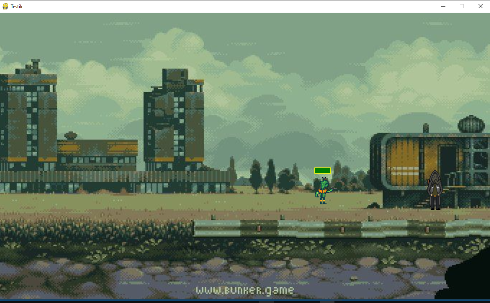

# Pygame 2D Shooter: [sky_problem_game]

This project is a 2D shooter game developed using **Python** and the **Pygame** library. Its primary goal is to showcase proficiency in **Object-Oriented Programming (OOP)**, modular architecture, and the implementation of fundamental game mechanics.

## Key Technical Highlights

The game demonstrates several key software development and algorithmic concepts essential for game logic:

1.  **Object-Oriented Architecture (OOP):**
    - Utilized separate, dedicated classes (`Player`, `Enemy`, `Projectile`, `Bullet`,`Settings`) to ensure the code is **modular**, scalable, and easy to maintain.
    - Inheritance and encapsulation are used to manage entity properties (health, speed) and behavior effectively.

2.  **Enemy AI & Movement:**
    - Implemented simple Enemy AI logic for pursuit.
    - Enemy movement is calculated using **vector math** (Euclidean distance and vector normalization) to determine the shortest and most direct path to the player at a constant speed, regardless of distance.

3.  **Collision Handling:**
    - Robust logic for detecting and responding to collisions between various entity types (e.g., player vs. enemy, projectile vs. enemy).

## Technologies Used

* **Language:** Python 3.x
* **Libraries:** Pygame

## How to Run the Project

To successfully launch and run the game, please follow these steps:

1.  **Clone the Repository:**
    ```bash
    git clone [https://github.com/evgenreva1986-cmd/Pygame_2D_shooter.git](https://github.com/evgenreva1986-cmd/Pygame_2D_shooter.git)
    ```
2.  **Navigate to the project directory:**
    ```bash
    cd Pygame_2D_shooter
    ```
3.  **Install Pygame:**
    ```bash
    pip install pygame
    ```
4.  **Run the main file:**
    ```bash
    python sky_problem_game.py 
    ```
    

## Screenshots (Optional but Recommended)

## Screenshots



---